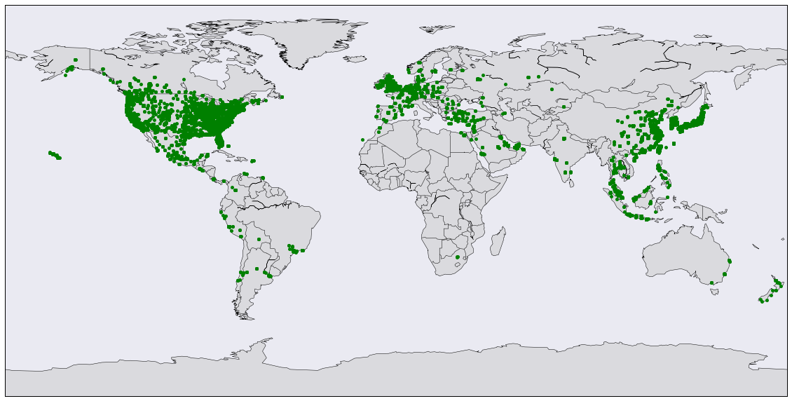
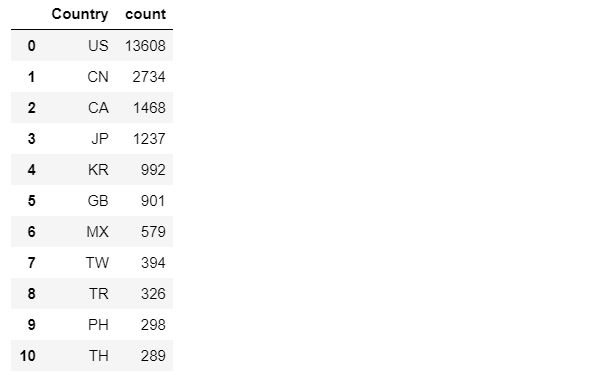
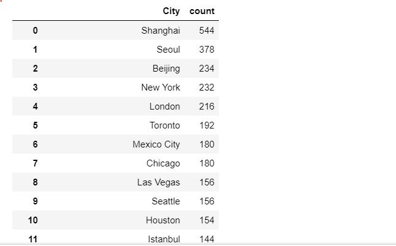

# Starbucks-Data-and-Webscraper
### To Run Locally
Download the entire project and run the jupyter noteboook.The project contains the input Data files.The output file will be created in the same directory

### Content
This repository contains the dataset file for location of starbucks around the world,jupyter notebook to anaylze thsi data and a sample webscrapper 
which scrapes different links and other details present in wwww.apple.com website
EDA.ipynb also contains code to convert different languages to English using opensource libraries in python.

### Sample images of analysis.Open EDA.ipynb for more 
- Locations of Starbucks around the world 

